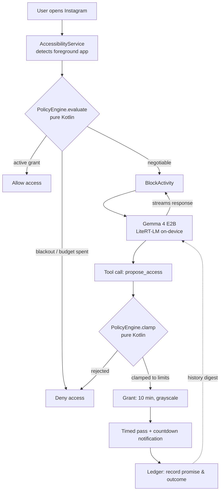

# Gatekeeper

An Android app blocker you negotiate with — powered by on-device Gemma 4.

Gatekeeper stops you from opening distracting apps, but instead of a hard block, it starts a conversation. State your reason for opening the app. Gatekeeper asks clarifying questions, remembers whether you kept your previous promises, and offers the minimal pass required — like 10 minutes in grayscale to send a single reply.

Built for the **UK AI Agents Lab Hackathon at Imperial College London** (Track 2 — Best Use of Gemma).

---

## How It Works

1. **100% On-Device:** Runs Gemma 4 E2B via LiteRT-LM locally on your phone. No API keys, no external network calls, and fully functional in airplane mode.
2. **Model Proposes, Policy Decides:** The model never has final authority. Gemma negotiates with you and calls `propose_access`. A deterministic, pure-Kotlin policy engine (`PolicyEngine.clamp()`) evaluates that proposal against hard limits you set while calm.
3. **Jailbreak Proof:** Even if you prompt-inject the model into granting 8 hours of screen time, `PolicyEngine.clamp()` caps the grant to your preset maximum (e.g. 15 minutes) or rejects it entirely.

---

## Architecture



> **Core Safety Invariant:** Gemma only generates proposals. The pure-Kotlin policy engine owns the decision diamonds.

---

## Quick Start

### Prerequisites
- Android 12+ device (Google Pixel recommended)
- JDK 21 & Android SDK installed
- `adb` configured

### 1. Download & Push Model Weights
Obtain `gemma-4-E2B-it.litertlm` (from Hugging Face LiteRT community) and push to your device:

```bash
adb push gemma-4-E2B-it.litertlm /sdcard/Download/
```

### 2. Build & Install

```bash
export JAVA_HOME=$(/usr/libexec/java_home -v 21) # Or your JDK 21 path
./gradlew installDebug
```

### 3. Grant Device Permissions
On first launch, enable the following Android permissions:
- **Accessibility:** Settings → Accessibility → Gatekeeper
- **Usage Access:** Settings → Apps → Special access → Usage access
- **Display Over Other Apps:** Settings → Apps → Special access → Display over other apps

---

## Testing

Run unit tests on the JVM (includes 25 tests verifying `PolicyEngine` invariants and adversarial jailbreak resistance):

```bash
./gradlew :app:testDebugUnitTest
```

---

## Repository Structure

For AI agents working on this repo, read [`AGENTS.md`](AGENTS.md) first.

| Document | Description |
|---|---|
| [`docs/00-RESEARCH.md`](docs/00-RESEARCH.md) | Analysis of existing app blockers and failure modes |
| [`docs/01-PRD.md`](docs/01-PRD.md) | Product scope, user flows, and demo script |
| [`docs/02-ARCHITECTURE.md`](docs/02-ARCHITECTURE.md) | Package layout, policy engine contracts, and state machine |
| [`docs/03-UI-SPEC.md`](docs/03-UI-SPEC.md) | Material 3 Expressive UI specifications |
| [`docs/04-BUILD-PLAN.md`](docs/04-BUILD-PLAN.md) | Hour-by-hour build milestones |
| [`docs/05-PROMPTS.md`](docs/05-PROMPTS.md) | System prompt engineering, tool schemas, and evals |
| [`docs/06-SUBMISSION.md`](docs/06-SUBMISSION.md) | Hackathon submission deliverables and video outline |

---

## License

[MIT License](LICENSE) — Imperial College London, August 2026.
