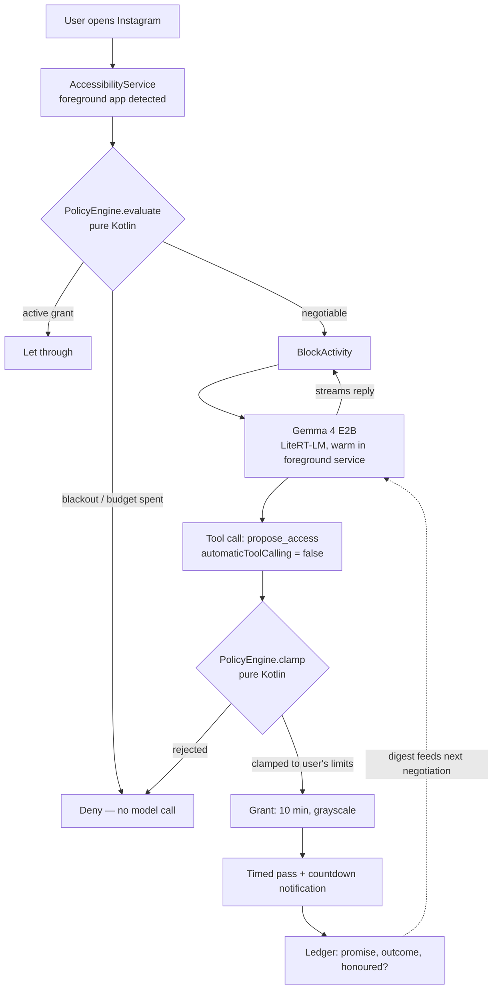

# Gatekeeper

A blocker you can argue with.

Gatekeeper stops you opening distracting apps — but instead of a wall, you get a negotiation. Tell it why you want in. It asks a question, remembers what you promised last time, and offers you the smallest amount of access that actually meets the need. Ten minutes in grayscale to send one reply, not an hour of scrolling.

The whole thing runs on the phone. Gemma 4 E2B via LiteRT-LM, no network, no account. Your excuses stay on your device.

**Android / Pixel · Kotlin · Jetpack Compose · Gemma 4 E2B · LiteRT-LM**

Built for the UK AI Agents Lab hackathon at Imperial — **Track 2, Best Use of Gemma**.

---

## Architecture



**The model never touches either decision diamond.** Gemma negotiates and proposes; a deterministic, pure-Kotlin policy engine decides. Talk it into offering eight hours and the clamp still returns fifteen minutes or a refusal.

## Setup

Requires a Pixel (or any Android 12+ device) and `adb`.

Requires **JDK 21** and the Android SDK.

```bash
# 1. Get the model — ~1.25 GB, from the litert-community org on Hugging Face.
#    ModelProvider probes /data/local/tmp and /sdcard/Download as well as the
#    app's own files dir, so either of these works:
adb push gemma-4-E2B-it.litertlm /sdcard/Download/
# or, if /sdcard is awkward on your device:
adb push gemma-4-E2B-it.litertlm /data/local/tmp/

# 2. Build and install
export JAVA_HOME=$(/usr/libexec/java_home -v 21)   # or your JDK 21 path
./gradlew installDebug

# 3. Grant permissions (the app deep-links to each of these)
#    Settings → Accessibility → Gatekeeper
#    Settings → Apps → Special access → Usage access
#    Settings → Apps → Special access → Display over other apps
```

Run the policy tests — 25 of them, including the adversarial cases that prove a
jailbroken model still can't mint an oversized grant:

```bash
./gradlew :app:testDebugUnitTest
```

The model is not committed to this repo. After the first launch nothing else needs a network connection — the app works fully in airplane mode.

---

## For agents

Start at **[`AGENTS.md`](AGENTS.md)**, then read `docs/` in numbered order. Your work queue is [`docs/04-BUILD-PLAN.md`](docs/04-BUILD-PLAN.md).

## For humans

| | |
|---|---|
| [`docs/00-RESEARCH.md`](docs/00-RESEARCH.md) | How every existing blocker works, and what they all get wrong |
| [`docs/01-PRD.md`](docs/01-PRD.md) | Scope and the six-beat demo |
| [`docs/02-ARCHITECTURE.md`](docs/02-ARCHITECTURE.md) | Modules, the negotiation loop, the policy contract |
| [`docs/03-UI-SPEC.md`](docs/03-UI-SPEC.md) | Visual language — native Pixel, M3 Expressive, dynamic color |
| [`docs/04-BUILD-PLAN.md`](docs/04-BUILD-PLAN.md) | Phased tasks with acceptance criteria |
| [`docs/05-PROMPTS.md`](docs/05-PROMPTS.md) | System prompt, tool schema, eval pleas |
| [`docs/06-SUBMISSION.md`](docs/06-SUBMISSION.md) | Deliverables, video script, write-up, judging alignment |

## The one design rule

**The model proposes; the policy engine disposes.** Gemma emits a structured proposal. A pure-Kotlin, deterministic policy layer clamps it against limits the user set while calm. If the model can be talked into granting eight hours — and it can — that proposal comes out the other side as fifteen minutes or a refusal.

MIT licensed. Built at the UK AI Agents Lab hackathon, Imperial College London, August 2026.
