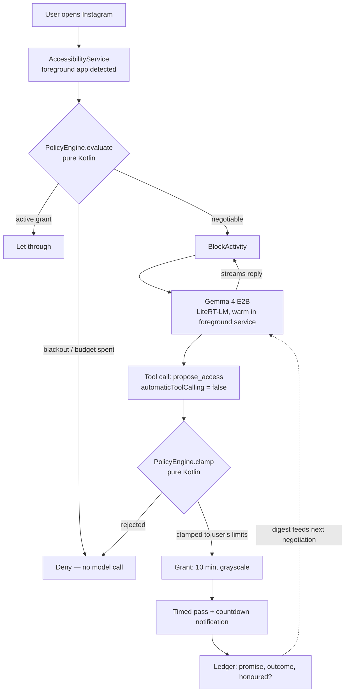

# 06 — Submission

Everything the brief requires, plus the assets. Owned by whoever is *not* debugging at 15:30.

## Track

**Track 3 — Hybrid Gemini + Gemma.** Privacy-preserving on-device Gemma 4 negotiation combined with opt-in Gemini 3.7 Flash weekly reflections.

**Track 3 (Hybrid Gemini + Gemma) is a live option**, and its prompt inspirations name "daily wellness companions — micro-agents that interpret daily habits and turn them into simple, actionable steps," which is also us. The honest split, if you take it:

- **Gemma 4, local** — the negotiation at the gate. Latency-critical, must work offline, and the content is a record of someone's compulsions.
- **Gemini 3.7 Flash, cloud** — an opt-in weekly reflection over the ledger. *"Your promises hold up before 10pm and collapse after it. Four of your nine broken promises were Sunday nights."* Longitudinal reasoning over aggregate data, not latency-critical, and the user explicitly opts in.

That split is defensible in Q&A because each model is where it belongs, rather than one being decoration. But it costs ~45 minutes and it dilutes "nothing leaves your phone," which is your cleanest line.

**Selected Track:** Track 3 — Hybrid Gemini + Gemma.

## Required deliverables

| # | Requirement | Owner | Done |
|---|---|---|---|
| 1 | Public GitHub repo — clean codebase, README, setup instructions, architecture diagram, MIT/Apache license | | ☐ |
| 2 | Proof of model integration — Gemma 4 via local runtime, visible in the code | | ☐ |
| 3 | 2-minute demo video (Loom or YouTube) — prototype, core flow, what it does | | ☐ |
| 4 | Write-up, 2–3 paragraphs — problem, architecture, why Gemini/Gemma, roadmap | | ☐ |

Create the repo and license at 09:00, not 17:00.

## Architecture diagram

Mermaid in the README renders natively on GitHub — this satisfies the requirement for free:

Say out loud in the README that **the model never touches the two decision diamonds**. That single fact is your innovation score.

## Video script — 2:00

Record on the device, screen capture, one take if you can. Airplane mode visible in the status bar throughout.

| Time | Shot | Say |
|---|---|---|
| 0:00–0:12 | Home screen, airplane mode toggled on camera | "Every blocker is a switch you eventually turn off. Crusty is one you have to argue with — and it runs entirely on this phone." |
| 0:12–0:35 | Tap Instagram → block screen → type *"just quickly checking something"* → agent pushes back | "It asks why. Vague answers don't earn time." |
| 0:35–1:00 | Type the real reason → agent offers 10 minutes, grayscale → accept | "A specific reason earns the smallest access that meets it. Ten minutes, grayscale, because you said one reply." |
| 1:00–1:15 | Instagram opens in grayscale, countdown in the shade | "The grant is timed and degraded. Then the block comes back." |
| 1:15–1:40 | Re-open → agent quotes the broken promise, offers less | "It remembers what you promised. This is the part no other app does." |
| 1:40–2:00 | Cut to the architecture diagram | "Gemma 4 E2B on LiteRT-LM, warm on-device. But the model only *proposes* — a deterministic policy engine clamps every grant. Talk it into eight hours and you still get fifteen minutes. No network, no account, nothing leaves the phone." |

Beat 1:15 is the one that wins. If the video runs long, cut the grayscale shot, never that one.

## Write-up (draft — edit for what actually shipped)

> **The problem.** Every self-control app on the market is a static rule you set while calm and confront while craving. There is nothing between total block and total surrender, so the only way through is a bypass — which is why the category has spent a decade in an arms race over uninstall protection rather than over the actual decision. Crusty replaces the wall with a negotiation: you can always get in, but you have to make a case to something that pushes back, remembers what you promised last time, and offers the smallest access that meets the need you stated.
>
> **Architecture.** A Gemma 4 E2B model runs on-device via LiteRT-LM, held warm in a foreground service so it is ready the instant an accessibility service detects a watched app coming to the foreground. The model negotiates in natural language and then calls a single `propose_access` tool. Crucially, we set `automaticToolCalling = false`: the model's proposal is handed to a pure-Kotlin, deterministic policy engine which clamps it against limits the user set in advance, and only that engine can mint a grant. The model is a negotiator, never an authority — prompt-inject it into offering eight hours and the clamp still returns fifteen minutes or a refusal, which we cover with adversarial unit tests. Outcomes are written to a local ledger whose digest feeds the next negotiation, so the agent can quote your last broken promise back to you.
>
> **Why Gemma.** Three reasons, all load-bearing. Latency: the negotiation happens in the two seconds between reaching for an app and giving up, and a round trip is too slow. Availability: the moment this matters most is 1am on a bad connection, and the app has to work in airplane mode. Privacy: the input is a running record of a person's compulsions, and the only defensible place for that is the device. E2B's native structured function calling is what makes the proposal/clamp split possible at all.
>
> **Roadmap.** Counter-offer modes beyond grayscale — hiding an app's feed while leaving search and DMs intact, delayed grants, and grants conditional on doing something first. Website blocking through a local VPN loopback. An opt-in weekly reflection using Gemini 3.7 Flash over the aggregate ledger, where longitudinal reasoning is worth a cloud call and privacy can be preserved by design. And a rule-change cooldown so limits cannot be loosened in the moment they bind.

## Judging alignment — where the points are

| Criterion | % | What we lean on |
|---|---|---|
| Technical execution & model leverage | 30 | Local inference on LiteRT-LM, structured tool use, warm-engine latency work, speculative decoding. **Quote real numbers**: time-to-first-token, tokens/sec, interception latency |
| Innovation & originality | 25 | The proposal/clamp split. Say plainly: this is not an AI wrapper — the model is deliberately not trusted, and here are the tests |
| Real-world impact & UX | 25 | A real behaviour-change literature base (the *one sec* PNAS result), a native-Pixel UI, and an explicit refusal to build the stalkerware-style lockdown the category defaults to |
| Presentation & live demo | 20 | Airplane mode on camera. Rehearsed five times. The broken-promise beat |

## Final checklist

- [ ] Repo public, license present, README complete with setup and diagram
- [ ] `.litertlm` model **not** committed — instructions to `adb push` instead
- [ ] No API keys, no `local.properties`, in the history
- [ ] Video uploaded, link works in an incognito window
- [ ] Write-up pasted into the submission form
- [ ] Demo device: charged, airplane mode, accessibility granted, ledger seeded, kill-switch known
- [ ] Submitted by **17:15**
